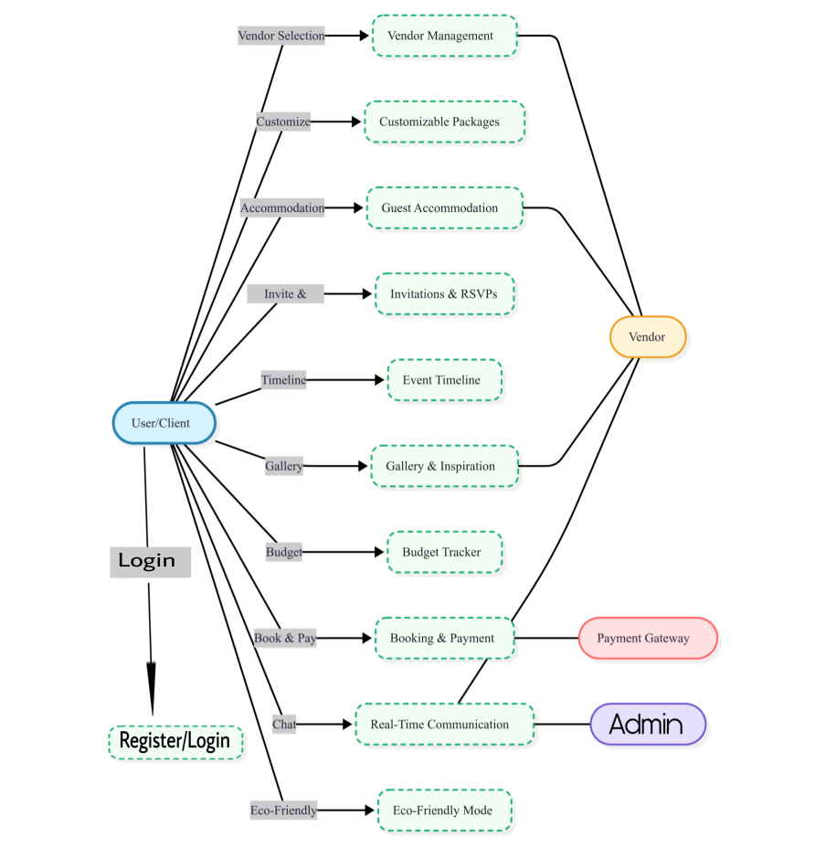
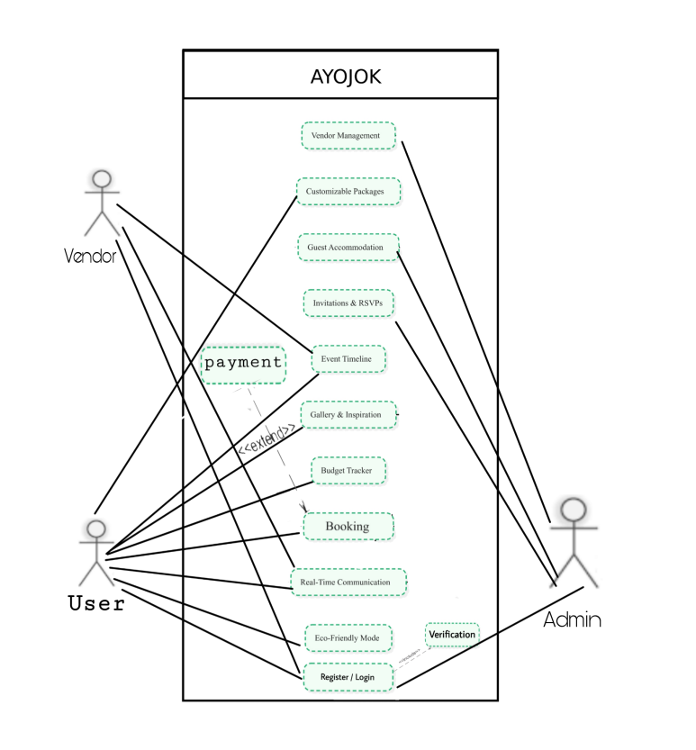
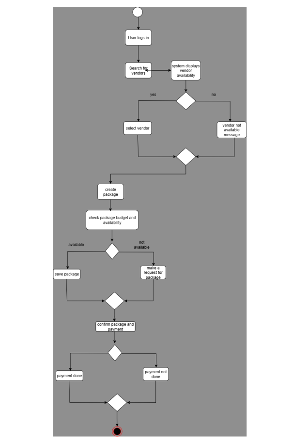
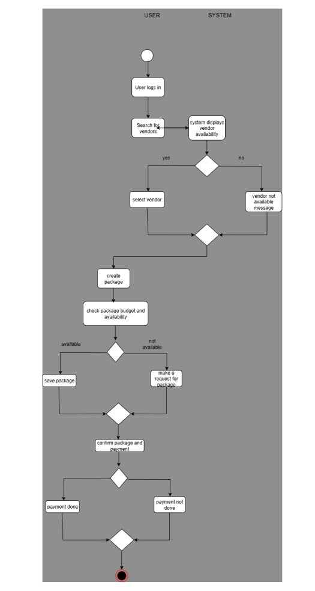

# AYOJOK – Wedding & Event Management System 🎉


AYOJOK is an all-in-one **wedding and event management platform** designed to simplify the complexities of event planning for clients, couples, vendors, and event organizers.  
The system integrates essential tools such as **vendor booking, customizable service packages, online payments, digital invitations, budget tracking, and eco-friendly event planning** — all from a single dashboard.  

---

## 🚀 Features

- 🔍 **Vendor Management** – Search, compare, and book vendors with profiles & reviews.  
- 📦 **Customizable Packages** – Flexible event packages with instant price updates.  
- 💳 **Online Booking & Secure Payments** – Integrated payment gateway.  
- ✉️ **Digital Invitations & RSVP Tracking** – Send eco-friendly invites and monitor responses.  
- 📅 **Event Timeline & Checklist** – Auto-reminders and progress tracking.  
- 🏨 **Guest Accommodation Management** – Suggestions and coordination tools.  
- 💰 **Budget Tracker** – Real-time expense tracking with alerts & reports.  
- 💬 **Real-Time Communication** – Chat with vendors and planners.  
- 🌱 **Eco-Friendly Mode** – Sustainable, paperless event planning.  

---

## 🛠️ Tech Stack

- **Frontend:** React.js  
- **Backend:** Node.js, PHP, Java  
- **Database:** MongoDB, MySQL, PostgreSQL  
- **Architecture:** Waterfall Model (SDLC) – Requirement Analysis → Design → Implementation → Testing → Deployment → Maintenance  

---

## 📊 System Design

### 📌 Context Diagram


### 📌 DFD (Level 1)


### 📌 Use-Case Diagram


### 📌 Activity Diagram


### 📌 Swimlane Diagram

---

## 📋 Installation & Setup

```bash
# Clone the repository
git clone https://github.com/your-username/ayojok.git

# Navigate to project folder
cd ayojok

# Install dependencies (example for Node.js backend + React frontend)
npm install
cd client && npm install

# Run development servers
npm start
